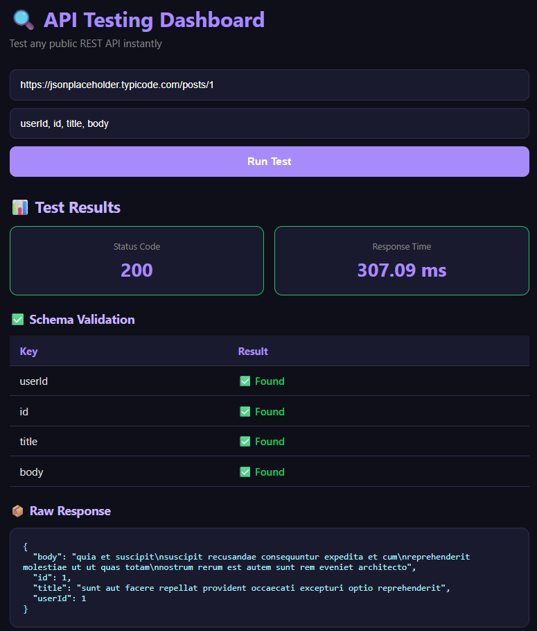

#  API Response Testing Dashboard

A lightweight web tool that accepts any public REST API endpoint and runs automated quality checks — including status code verification, response time measurement, and schema validation.

---

##  Features

-  **Status Code Verification** — Checks if the API returns expected HTTP status
-  **Response Time Measurement** — Measures how long the API takes to respond
-  **Schema Validation** — Verifies if expected keys exist in the JSON response
-  **Raw JSON Viewer** — Displays the full formatted API response

---

## Tech Stack

| Layer | Technology |
|-------|-----------|
| Backend | Python, Flask, Requests |
| Frontend | HTML5, CSS3, Vanilla JavaScript |

---

## Project Structure
api-testing-dashboard/
- backend/
  - app.py (Flask backend)

- frontend/
  - index.html (Main UI)
  - style.css (Styling)
  - script.js (Frontend logic)

- requirements.txt (Python dependencies)
---

##  How to Run Locally

**1. Clone the repository**
```bash
git clone https://github.com/tanishajain-12/api-testing-dashboard.git
cd api-testing-dashboard
```

**2. Install Python dependencies**
```bash
pip install -r requirements.txt
```

**3. Start the backend**
```bash
cd backend
python app.py
```

**4. Open the frontend**

Just open `frontend/index.html` in your browser.

---

##  Test It With This Free API

Paste this in the dashboard:
https://jsonplaceholder.typicode.com/posts/1

Expected keys:
id, title, body, userId

---

##  Screenshot



---

##  Developed By

Tanisha Jain — [github.com/tanishajain-12](https://github.com/tanishajain-12)